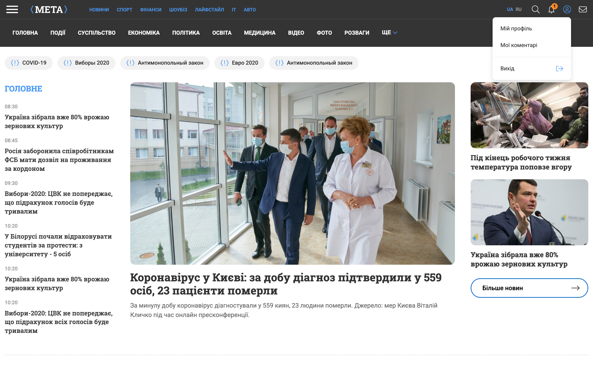
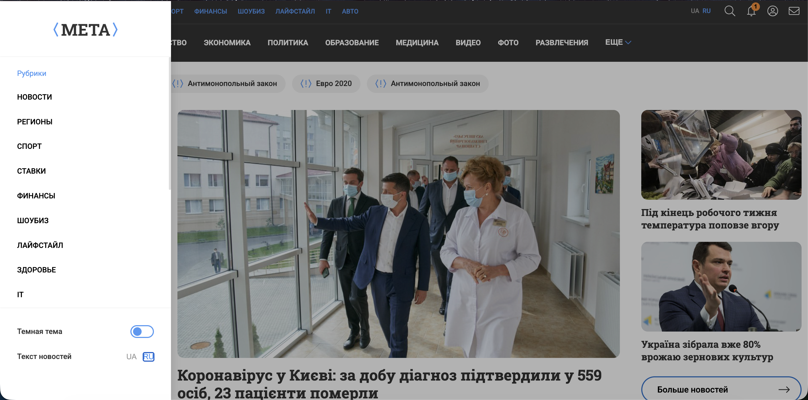
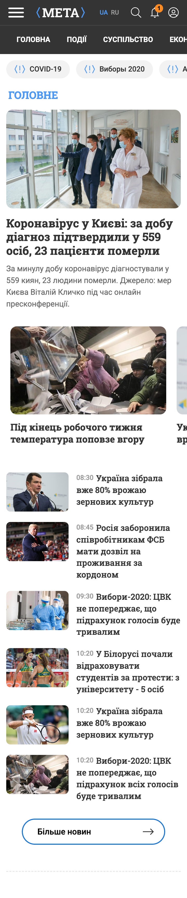

# Frontend Test Task — News (META Digital Sports Media)

## Опис проєкту
Це адаптивна верстка головної сторінки новинного порталу, виконана в межах тестового завдання. Проєкт реалізовано як SPA (Single Page Application) на базі **Vue 3**, з фокусом на продуктивність, компонентну структуру та високу точність відповідності макету.

## Стек технологій
- **Framework:** Vue 3 (Composition API)
- **Build Tool:** Vite
- **Styles:** SCSS (SASS)
- **Routing:** Vue Router
- **Internationalization:** Vue I18n

## Використані бібліотеки
- `swiper` — для реалізації мобільних слайдерів.
- `autoprefixer` — для автоматичного додавання вендорних префіксів у CSS.

## Реалізований функціонал

### Адаптивність та верстка
- **Кросбраузерна верстка**: Коректне відображення у всіх сучасних браузерах.
- **Adaptive / Responsive**: Проєкт повністю адаптований під Desktop (1024px+), Tablet та Mobile (від 360px).
- **Full-bleed ефекти**: Певні блоки (навігація, теги, слайдери) візуально виходять за межі контейнера на мобільних пристроях для кращого UX.
- **Typography**: Інтегровано шрифт Roboto Slab для заголовків та Roboto для основного тексту.

### Інтерактивні елементи
- **Profile Dropdown**: Контекстне меню профілю, що відкривається/закривається по кліку та закривається при кліку за межами блоку.
- **Sidebar Menu (Burger)**: Бокове меню, виїжджає зліва. Має overlay-затемнення і закривається по кнопці Escape або кліку на фон.
- **Багатомовність**: Реалізовано перемикання локалей (UA/RU) з підтримкою locale-based routing.
- **Categories Navigation**: Навігація, ховає лишні пункти у випадаюче меню "Ще".
- **Trending Tags**: Секція тегів з горизонтальним скролом на мобільних.
- **Swiper Slider**: У блоці "Top Stories" на мобільних реалізовано слайдер із фіксованою шириною карток (max 300px).

## Виконані пункти тестового завдання
- [x] Desktop та Mobile версії (360px - 1440px+).
- [x] Валідна, семантична та кросбраузерна верстка.
- [x] Використання Vite та SCSS.
- [x] Контекстне вікно профілю з логікою закриття.
- [x] Бокове меню (Sidebar / Burger Menu).
- [x] Виконання на Vue.js 3.
- [x] Реалізовано перемикання мов (реактивно).

### Desktop версія



### Mobile версія


## Запуск проєкту локально

1. **Встановлення залежностей**:
   ```bash
   npm install
   ```

2. **Запуск у режимі розробки**:
   ```bash
   npm run dev
   ```

3. **Збірка для продуктиву**:
   ```bash
   npm run build
   ```

---

**Затрачений час (чистий час):** `4 години`
